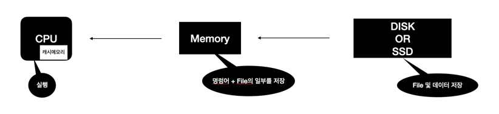

<h1> Cache란? </h1>

-------

<h2> 컴퓨터의 연산처리 과정</h2>

 컴퓨터가 연산을 처리하기 위해서 Disk에 저장된 파일을 메모리에서 일부를 불러온 다음 캐시 메모리에서 메모리에 있는 
명령어를 읽어와 cpu에서 실행을 하는 순서로 작업을 진행하게 된다.  
여기서 cpu의 캐시 메모리가 필요한 이유는 메모리 자체도 빠른 성능을 보여주지만 캐시 메모리를 통해 보다 빠른 실행이 가능하도록 하기 위함이다.

----

<h2> file 캐시 </h2>

 우리가 웹사이트를 이용할때 사용되는 캐시는 이미지와 같은 크기가 있는 데이터를 사용자의 요청시 마다 보내주는 것은 효율적이지 않기 때문에 용량이 있는 데이터를 브라우저의 메모리 공간에 미리 저장을 하여 
일정 기간동안 관리를 하게 되는 것으로 사용자의 중복되는 요청에 불필요한 리소스 낭비를 줄여 빠른 속도로 랜더링이 가능하다는 장점이 존재한다.  
그러나 이는 데이터가 보관되어 있는 기간동안 서버의 이미지가 변경되는 경우 변경된 이미지를 노출하지 않을 수 있기 때문에 캐시를 지우고 다시 요청을 보내면 정상적으로 확인이 가능하다.

-----

<h2> CDN (Content Delivery Network) </h2>

 
CDN에서 의미되는 캐시는 글로벌하게 서비스가 운영되는 경우 한국의 서버를 미국의 사용자가 이용하고자 할때 한국에서 데이터를 전송하기 때문에 물리적인 문제로 인해 네트워크의 지연이 발생되게 된다.  
이때 CDN은 이러한 네트워크 지연을 방지하기 위에 서비스 하고자 하는 지역에 서버를 두고 미리 데이터를 저장하여 네트워크의 지연을 최소화 하는 방식으로 서비스를 하게 되는데 이러한 것을 캐시되어 있다고 한다.  

<h3> CDN 이란? </h3>
데이터 사용량이 많은 애플리케이션의 웹 페이지 로드 속도를 증가시키는 상호 연결된 네트워크 서버를 의미한다.

