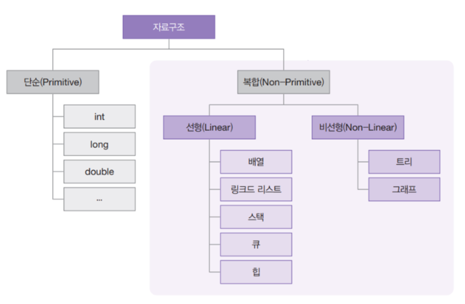
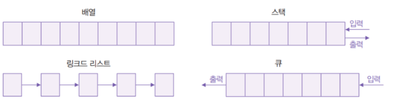
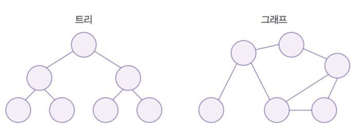
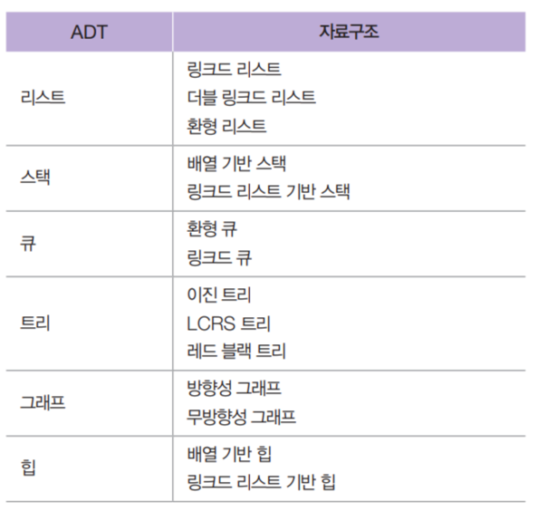

<h1> Data Structure </h1>

-----

<h2> 자료구조란? </h2>

    자료구조는 데이터를 조직화하고 저장하는 방법을 다루는 학문 분야이다.  
    자료구조는 프로그래밍에서 중요한 역할을 하고 있으며 프로그램이 데이터를 저장, 검색, 정렬, 수정 및 삭제하는 방식에 따라 성능에 영향을 준다.  

<h2> 자료구조의 종류 </h2>

- 배열 : 일련의 동일한 유형의 데이터를 연속적으로 저장한다.
- 연결 리스트 : 데이터를 노드로 나누어 각 노드가 데이터와 다음 노드에 대한 포인터를 가지도록 한다.
- 스택 : 데이터를 마지막에 추가하고 마지막으로 추가된 데이터를 가장 먼저 제거한다.
- 큐 : 데이터를 마지막에 추가하고 처음 추가한 데이터를 가장 먼저 제거한다.
- 해시 테이블 : 키-값 쌍을 저장하는 자료구조로, 빠른 검색을 위해 해시 함수를 사용한다.

자료구조는 컴퓨터 과학의 기본 개념 중 하나이며, 프로그래밍에서 매우 중요하다.  
효율적인 자료구조를 사용하면 프로그램의 성능을 향상시키고, 메모리 사용을 최적화하고, 코드의 가독성을 향상시키는 등의 장점이 있다.  

- 복잡한 자료구조는 다시 선형 자료구조(Linear Data Structure)와 비선형 자료구조(Non-Linear Data Structure)로 나눈다.  
  선형 자료구조는 다음 그림처럼 데이터 요소를 순차적으로 연결하는 자료구조로, 구현하기 쉽고 사용하기도 쉽다.  
  배열(Array)과 링크드 리스트, 스택, 큐 등이 여기에 해당합니다.
  

- 비선형 자료구조는 선형 자료구조와 달리 데이터 요소를 비순차적으로 연결한다.  
  다음과 같이 한 데이터 요소에서 여러 데이터 요소로 연결되기도 하고, 여러 데이터 요소가 하나의 데이터 요소로 연결되기도 한다.  
  트리와 그래프가 바로 여기에 해당하며 비선형 자료구조와 달리 데이터 요소를 비순차적으로 연결한다.  
  다음과 같이 한 데이터 요소에서 여러 데이터 요소로 연결되기도 하고, 여러 데이터 요소가 하나의 데이터 요소로 연결되기도 한다.  
  트리와 그래프가 여기에 해당한다. 
  

<h2> 자료구조와 관련해서 알아두면 좋은 개념 </h2>

바로 추상 데이터 형식, 다시 말해 ADT(Absract Data Types)로 이것은 자료구조의 동작 방법을 표현하는 데이터 형식이다.  
리스트로 예를 들면, 리스트는 데이터에 순차적으로 접근해서 그 데이터를 다룰 수 있도록 여러 기능을 제공해야 하며 목록의 특징 위치에 있는 노드에 접근(get)하거나, 목록의 마지막에 데이터를 추가(Append)하거나, 목록 중간에 삽입(Insert)하거나, 삭제(Remove)하는 기능을 말한다.  

이렇게 ADT가 청사진을 제시하면 자료구조는 이를 구현한다. 배열로 리스트를 구현한다고 가정하면 배열의 길이가 곧 리스트의 길이가 되고 배열의 첫 요소는 시작 노드, 배열의 마지막 요소는 마지막 노드가 된다.  
현재 다루고 있는 요소의 첨자(index)가 현재 노드가 되겠죠. 여기에 탐색/추가/사입/수정/삭제와 같은 기능을 구현하면 하나의 자료구조가 완성된다.

<h2> 자료구조의 선택 기준 </h2>

- 자료의 처리 시간
- 자료의 크기
- 자료의 활용 빈도
- 자료의 갱신 정도
- 프로그램의 용이성 

자료의 처리를 보다 효율적으로 하기 위해서 위와 같은 사항을 고려하여 선택, 사용해야 한다.

