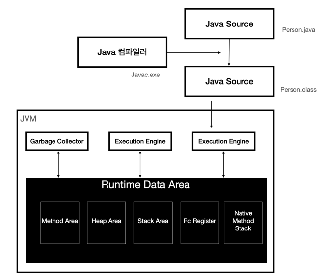

<h1> JVM 메모리 구조 </h1>

1. class loader : JVM 내로 클래스 파일을 로드하고 링크를 통해 배치하는 방식 작업을 수행하는 모듈이다. 런타임시에 동적으로 클래스를 로드한다.
2. Execution Engine : 클래스 로더를 통해 jvm 내의 Runtime Date area에 배치된 바이트 코드들을 명령어 단위로 읽어서 처리한다.   최초 jvm은 인터프린터 방식으로 동작하여 속도가 느린 단점이 있었으나 이를 JIT 컴파일 방식을 통해 개선하였다.
3. Garbage Collector : 힙 메모리에 있는 객체들중 참조가 되지 않은 객체를 식별하여 제거하는 역할을 수행하게 된다. (실행 시점을 정확하게 알 수 없다.)
4. Runtime Data Area : 애플리케이션 실행시 사용되는 데이터를 적재하는 영역이다.
   > Method Area, Heap Area, Stack Area, PC Register, Native Method Stack이 존재한다.
5. Method Area : JVM의 생성과 동시에 소멸되는 영역으로 JVM의 MaxMetaspaceSize 설정을 통해 사이즈를 조절하는 것이 가능하다.  
   또한 해당 영역에서 에러가 발생시 OutOfMemory, ClassNotFoundException, NoSuchMethodError와 같은 에러를 발생하게 된다.  
   해당 영역은 아래와 같은 정보를 저장하게 된다. 
   > 1. 런타임 상수 풀, 필드 및 메서드 데이터, 클래스 및 인터페이스 데이터를 포함한 클래스 수준의 데이터  
   > 2. 정적 변수 및 해당 값.
   > 3. 각 메서드에 대해 컴파일된 명령어인 바이트 코드 명령어.
   > 4. 클래스가 로드될 때 실행되는 클래스 초기화 코드.
   > 5. 다른 클래스 및 인터페이스의 대한 기호 참조.
6. Heap Area : 컴퓨터 프로그래밍에 있어 Heap Area는 런타임시 동적으로 할당되는 컴퓨터의 메모리 영역으로 힙 영역으로 동적 메모리 할당을 사용하여 할당된 객체 및 변수를 저장하는데 사용된다.   이러한 객체의 필요양의 따라 메모리의 크기가 결정된다.
  로컬 변수 및 함수 매개변수를 저장하는데 사용되는 메모리의 영역인 스택과 달리 힙 영역은 후입선출(LIFO) 방식으로 구성되지 않으며 대신 힙 영역의 메모리는 임의의 순서로 할당 및 할당 해제를 할 수 있다.
  프로그래머는 일반적으로 힙 영역을 사용하여 여러 함수나 스레드에서 액세스해야 하는 데이터 또는 단일 함수의 호출의 이상으로 지속되어야 하는 데이터를 저장하게된다.
  그러나 힙 영역은 언어 런타임 또는 운영 체제ㅇ에 의해 자동으로 관리되지 않으므로 메모리 누수 및 기타 문제를 방지하기 위해 메모리 할당 및 할당 해제를 신중하게 관리하는 것이 중요하다.
  이를 위해 자바에서는 GC(Garbage Collector)를 이용하여 메모리를 관리한다.
7. Stack Area : 모든 스레드에 대하여 JVM은 스택을 생성하게 되는데 이때 Stack에서 관리가 되는 데이터는 로컬변수와 매개변수를 저장하는 용도로 사용하게 된다.
     스택은 LIFO(Last In First Out) 데이터 구조를 가지고 있으며 가장 최근에 푸시된 데이터가 항상 먼저 액세스 된다는 것을 의미한다.
     함수가 반환되면 스택 포인터가 이전 위치로 다시 이동되고 함수의 데이터가 스텍에서 제거된다.
     스택은 로컬 변수 및 함수 매개 변수를 저장하는데 사용되므로 일반적으로 함수 범위를 벗어나는데 필요하지 않은 임시 데이터에 사용된다.
     스택의 크기는 컴파일 타임에 고정되어 있다. 즉, 스택에 할당된 메모리의 양은 프로그램 실행 중에 변경할 수 없다.
     스택 오버플로우는 스택의 메모리가 부족하여 새 함수 호출이나 지역 변수를 위한 추가 공간을 할당할 수 없을 때 발생되는데 이것은 프로그램에 너무 많은 재귀 함수 호출을 하거나 함수가 스택에 너무 많은 메모리를 할당하는 경우에 발생할 수 있다.
8. PC Register : 자바는 OS,CPU 입장에서는 하나의 프로세스이기 때문에 JVM의 리소스를 이용해야 된다. 그래서 CPU에 직접 연산을 수행하도록 하는 것이 아닌, 현재 작업 내용을 CPU에게 제공해야 하는데 이를 위해 PC Register 영역을 만들게 된 것이다.
     PC Register는 직접적으로 연산을 저장하는 것이 아닌 주소를 저장하는 방식을 가지고 있으며 스레드마다 PC register은 존재하고 있다.
     또한 연산이 끝난뒤 다음 연산을 진행하도록 하는 방식을 이용하여 다음 명령을 수횅하게 되는데 이는 PC의 풀네임인 Program Counter라는 것이 명시적으로 들어나는 부분이다.
9. Native Method Stack : 해당 공간은 바이트 코드가 아닌 프로그램을 실행할 수 있는 기계어가 작성된 프로그램을 호출하는 영역이다. 
     JVM은 네이티브 방식을 지원하기 때문에 스레드에서 네이티브 방식의 메소드가 실행되면 Native Method Stack-Area에 쌓이게 된다.

참고한 내용 
1. https://jiwonxdoori.tistory.com/33
2. Chat GPT