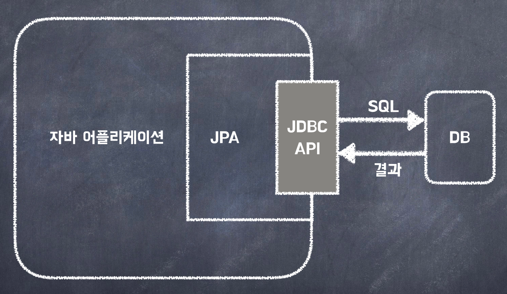

<h1> JPA </h1>

--------

<h2> JPA </h2>

    jpa는 자바에서 ORM 기술을 이용하여 객체와 관계형 데이터베이스의 매핑을 지원하는 인터페이스이다.  
    jpa를 사용하면 객체를 데이터베이스에 저장하고 조회하는 작업을 객체지향적으로 처리하는 것이 가능해진다.  

<h2> JPA 특징 </h2>

    jpa를 사용하면 sql 쿼리를 작성하지 않아도 되는 이점이 있다. 이를 통해 객체 지향적 방식으로 객체를 다루는 것이 가능하다.  
    또한 jpa를 이용하면 ORM 기술을 통해 데이터베이스와 관련된 복잡한 문제들을 해결하는 것이 가능해진다.   
     
    jap를 이용하게 되면 객체 지향적인 방식으로 데이터를 다룰수 있어 코드의 가독성과 유지보수성이 증가된다.  
    데이터베이스와 관계를 설정하는 작업을 줄일 수 있게 된다.  
    데이터베이스와 종류와 관계없이 일관된 방식으로 데이터를 다룰수 있게 된다.

<h2> 영속성 컨텍스트 </h2>

    jpa의 영속성 컨텍스트는 엔티티를 관리하는 영역으로, 엔티티의 상태를 보관하고 관리를 한다.  
    영속성 컨텍스트는 jpa에서 가장 중요한 부분중 하나이며 다름과 같은 장/단점이 존재한다.
     

<h4> 장점 </h4>

1. 1차 캐시  
   영속성 컨텍스트의 경우 엔티티를 조회할 때, 데이터 베이스에서 조회한 엔티티를 캐시에 저장하는데 이를 1차 캐시라고 한다.  
   따라서 같은 엔티티를 조회하는 경우 데이터베이스에 요청을 하지 않고 캐시에서 바로 가져오기 때문에 성능이 높아진다.
2. 동일성 보장  
   영속성 컨텍스트는 같은 엔티티를 조회하면, 항상 같은 인스턴스를 반환하며 이를 통해 동일한 엔티티의 대한 작업을 일괄되게 처리하는 것이 가능하다.
3. 트렌잭션 내에서 변경감지  
   영속성 컨텍스트는 트랜젝션을 지원하며 트렌젝션 내에서 엔티티의 변화가 감지되면 자동으로 데이터 베이스에 저장을 하게 되며, 해당 기능을 통해 데이터 베이스의 복잡한 요청을 해소 할 수 있다.
4. 지연로딩  
   영속성 컨텍스트는 엔티티를 로딩할 때, 연관된 엔티티를 함께 로딩할 수 있으며 이를 지연로딩이라고 한다.  
   이를 이용해 필요한 시점에 로딩을 하는 방식으로 하여 성능을 향상시키는 것이 가능해진다.

<h4> 단점 </h4>

1. 메모리 부담  
   영속성 컨텍스트는 엔티티를 캐시에 저장함으로 많은 엔티티를 이용하는 경우 메모리에 부담이 생길 수 있다.
2. 동시성 이슈  
   영속성 컨텍스트는 동시성 이슈를 가지고 있을 수 있으며, 여러 사용자가 같은 엔티티를 동시에 수정하는 경우 충돌 문제가 발생할 수 있음  
    이러한 문제를 해결하기 위해 적절한 동기화 작업이 필요하다.
3. 영속성 전의의 부작용
   Chascade 옵션을 통해 부모엔티티를 저장할때 자식 엔티티를 저장하는 것이 가능하다. 그러나 이러한 작업은 부작용이 발생될 수 있는데 부모엔티티를 삭제하게 되는 경우 자식 엔티티도 함께 삭제가 되면서 다른 엔티티에 영향을 주게 될 수 있다.
4. 지연로딩 문제
   지연 로딩을 필요 시점에 연관된 엔티티를 조회하는 방식으로 성능 최적화에는 유리하지만 영속성 컨텍스트의 범위를 벗어나게 되면 LazyInitializationException이 발생하게 될 수 있다.   이는 영속성 컨텍스트에 존재하지 않는 엔티티를 이용할때 발생되는 문제로 이를 해결하기 위해서는 적절한 방식으로 엔티티를 조회 해야 한다.
5. 영속성 컨텍스트의 생명주기 관계
   영속성 컨텍스트는 트렌젝션 범위에 따라서 생성되고, 트랜젝션이 종료할때 함께 종료되며 이러한 영속성 컨텍스트의 생명주기를 제대로 관리하지 않으면 예상하지 못하는 문제가 발생될 수 있다.
