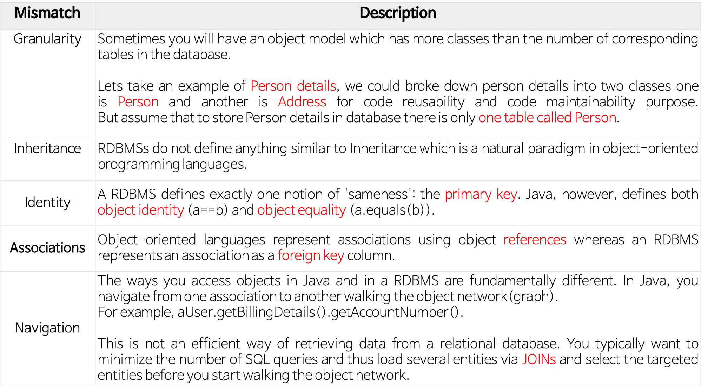
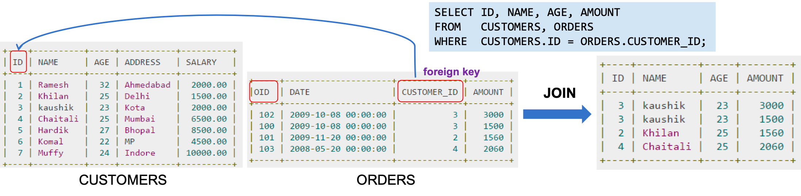
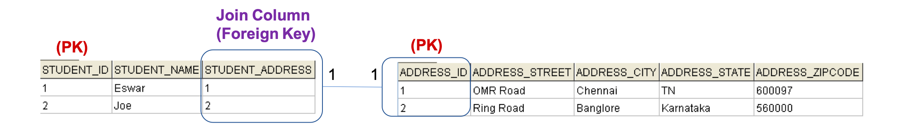

<h1> ORM 이란? </h1>

------

<h2> 영속성(Persistence) </h2>

- 데이터를 생성한 프로그램을 종료하더라도 사라지지 않는 것을 의미한다.
- 영속성을 갖지 않는 데이터는 단지 메모리에서 존재하기 때문에 프로그램을 종료하면 데이터가 사라지게 된다.
    ex) Redis, h2

- Object Persistence(영구적인 객체)
  - 메모리상의 데이터를 파일시스템, 관계형 데이터 베이스 혹은 객체 데이터베이스를 활용하여 영구적으로 저장하여 영속성을 부여한다.
  - 
  - 데이터를 저장하는 방법 
    - jdbc
    - Spring JDBC
    - Persistence Framework (Hibernate, Mybatis)
  - Persistence Layer
    - 프로그램의 아키텍처에서 데이터의 영속성을 부여해주는 계층을 의미한다.
    - JDBC를 이용하여 직접 구현할 수 있으나 Persistence framework를 이용해서 많이 작업을 진행한다.
  - Persistence Framework 
    - JDBC 프로그래밍의 번거로운 작업 없이 간단한 작업만으로 데이터베이스와 연동되는 시스템을 빠르게 개발할 수 있으며 안정적인 구동을 보장한다.
    - Persistenct Framework는 SQL Mapper와 ORM으로 나눌수 있다.
      - EX) JPA, Hibernate, Mybatis 등

<h3> ORM </h3>

Object Relation Mapping, 객체-관계 매핑

- 객체와 관계형 데이터베이스의 데이터를 자동으로 매핑(연결)해주는 것을 말한다.
  - 객체 지향 프로그래밍은 클래스를 사용하고, 관계형 데이터 베이스는 테이블을 사용한다.
  - 객체 모델과 관계형 모델 간의 불일치가 존재한다.
  - ORM을 통해 객체 간의 관계를 바탕으로 sql을 자동으로 생성하며 불일치를 해결한다.
- 데이터베이스 데이터 <-- 매핑 --> Objcet 필드
  - 객체를 통해 간접적으로 데이터 베이스 데이터를 다룬다.
- Persistence API라고도 할 수 있다.
  - EX) JPA, Hibernate

<h3> ORM 장/단점 </h3>

- 장점
  - 객체 지향적인 코드로 인해 더 직관적이고 비즈니스 로직에 집중할 수 있게 도와준다.
    - ORM을 이용하면 SQL Query가 아닌 직관적인 코드(메서드)로 데이터를 조작할 수 있어 개발자가 객체 모델로 프로그래밍 하는데 집중할 수 있도록 한다.
    - 선언문, 할당, 종료 같은 부수적인 코드가 없거나 급격하게 줄어든다.
    - 각종 객체의 대한 코드를 별도로 작성하기 때문에 코드의 가독성을 높여준다.
    - sql의 절차적이고 순차적인 접근이 아닌 객체 지향적 접근으로 인해 생산성이 증가한다.
  - 재사용 및 유지보수성의 편리성이 증가한다.
    - ORM은 독립적으로 사용할 수 있으며, 해당 객체들을 재활용 할 수 있다.
    - 모델에서 가공된 데이터를 컨트롤러에 의해 뷰와 합쳐지는 형태로 디자인 패턴을 견고하게 다지는데 유리하다.
    - 매핑정보가 명확하겨 ERD의 대한 의존을 낮출수 있다.
  - DBMS의 대한 종속성이 낮아진다.
    - 객체 간의 관계를 바탕으로 SQL문을 생성하기 때문에 RDBMS의 구조와 자바 객체지향 모델 사이의 간격을 좁힐 수 있다.
    - 대부분의 ORM 솔루션은 DB에 종속적이지 않다.
    - 종속적이지 않다는 것은 구현 방법 뿐만 아닌 많은 솔루션에서 자료형 타입까지 유효하다.
    - 개발시 Object에 집중할 수 있음으로 극단적으로 DBMS를 교체하는 거대한 작업에도 비교적 적은 리스크와 시간이 소요된다.
    - 자바에서 작업을 하는 경우 Equals, hashCode의 오버라이드 같은 기능을 이용할 수 있으며 간결하고 빠른 가공이 가능하다.
  
- 단점
  - 완벽히 ORM만 가지고 서비스를 구현하는 것은 어렵다.
    - 사용은 편리하지만 설계는 신중하게 해야한다는 문제가 있다.
    - 프로젝트의 복잡성이 커질수록 난이도 또한 올라가게 된다.
    - 잘못 구현하는 경우 속도 저하 및 심각할 경우 일관성이 무너지는 문제가 발생된다.
    - 일부 자주 사용하는 대형 쿼리는 속도를 위해 SP를 쓰는등 별도의 튜닝이 필요한 경우가 있다.
    - DBMS의 고유 기능을 사용하는 것이 어렵다.
  - 프로시저가 많은 시스템에서는 ORM의 객체 지향의 장점만 활용하는 것은 어렵다.
    - 이미 프로시저가 많은 시스템의 경우 다시 객체로 봐꿔야하며, 그 과정에서 생산성 저하나 리스크 저하가 많이 발생 될 수있다.

<h3> The Object-Relational Impedance Mismatch </h3>

- Granularity(세분성)
  - 경우에 따라서 데이터 베이스에 있는 테이블의 수보다 더 많은 클래스를 가진 객체 모델을 가질 수 있다.
  - 예시 "사용자 세부 사항"의 경우 
    - 코드 재사용과 유지보수를 위해 "person"과 "Address"라는 두 개의 클래스로 나눌 수 있다.
    - 그러나 데이터베이스의 경우 "person"이라는 하나의 테이블에는 "사용자의 세부 사항"을 저장할 수 있다.
    - 위와 같이 Object 2개가 1개의 Table로 구성될 수 있다.
  - Coarse Granularity(굵은/거친) : personDetails Class
  - Fine Granularity(가는/세밀한) : persion Class, Address Class
- Inhertitance(상속) 
  - RDBMS는 객체지향 프로그래밍 언어의 자연적인 패러다임인 상속과 유사한 것을 정의하지 않는다.
- Identity(일치)
  - RDBMS는 "sameness"라는 하나의 개념을 정확히 정의하는데, 바로 '기본키(primary key)'이다.
  - 그러나 자바에서 객체 식별(a==b)과 객체 동일성(a.eqalues(b))을 모두 정의한다.
  - RDBMS에서는 PK가 같으면 서로 동일한 record로 정의하지만, java에서는 주소값이 같거나 내용이 같은 경우를 구분한다.
- Assotions(연관성)
  - 객체지향 언어는 객체 참조(reference)를 사용하는 연관성을 나타내는 반면, RDBMS는 연관성을 '외래키'로 나타낸다.
  - java에서 객체 참조(Object Referances)
    - 방향성이 있다.
      <pre>
        public class Employee{
          private int id;
          private String first_name;
          ....
          private Department department; // Employee -> Department
        }
      </pre>
    - java에서는 양방향 관계가 필요한 경우 연관을 두 번 정의 해야한다.
      - 즉 서로 Referance를 가지고 있어야 한다.
    - RDBMS의 외래키(Foregin key)
      - FK와 테이블 join은 관계형 데이터베이스를 자연스럽게 만든다.
      - 
  - One-To-One Relationship
    - RDBMS의 방향성이 없다.
      - 
      - 각 Student의 recod 서로 다른 Address의 recod를 가르키고 있으며 이것은 일대일 매핑을 보여준다.
    - java Object(방향성이 있다.)
      <pre>
        public class Student {
          private long studentId;
          private String studentName;
          private Address StudentAddress; // student -> address
          ...
        }
        
        public class Address{
          private long addressId;
          private String sreet;
          private String city;
          ...
        }
      </pre>
    - One-To-Many Relation Ship
      - 예를 들어, 학생이 여러개의 핸드폰을 사용하는 경우 
      - RDBMS(방향성이 있다.)
        - 각 Student의 recod는 여러 개의 Phone recod를 가질 수 있다.(일대다 매핑)
        - 이 관계는 하나의 다른 Table(Relational Model)로 만들수 있다.
        - One-To-Many를 구성하는 방 1) Join Table 2) Join Column
        - java Object(방향성이 있다.)
          <pre>
            public class Studnet{
              private long studentId;
              private String studentName;
              private Set<Phone> studentPhoneNumbers;
            }
            
            public class Phone{
              private long phoneId;
              private String phoneType;
            }
          </pre>
- Navigation(탐색/순회)
  - java 및 RDBMS에서 객체에 엑을스하는 방법은 근본적으로 다르다.
  - java에서는 하나의 연결에서 다른 연결로 이동하면서 탐색/순회한다.
  - RDBMS에서는 일반적으로 SQL 쿼리 수를 최소화하고 join을 통해 여러 엔티티를 로드하고 원하는 대상 엔티티를 선택한다.

