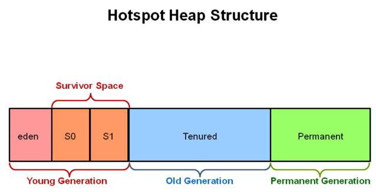

<h1>garbege Collector(가비지 컬렉터)</h1>

-------

<h2> 가비지 컬렉터란? </h2>

    가비지 컬렉터는 GC라고 줄여서 부르기도 하며 메모리를 관리하는 방법중 하나이다.  
    시스템에서 더이상 사용되지 않는 동적 할당 메모리를 블럭을 수집하여 자동으로 다시 사용이 가능한 상태로 자원을 회수하는 기능을 제공한다.  
    시스템이 시스템이 가비지 컬렉션을 수행하는 부분을 가비지 컬렉터라고 한다.  
    
가비지 컬렉터를 지원하는 언어는 별도로 존재하며 지원을 하지 않는 C언어 같은 경우 메모리를 할당한 뒤 수동으로 메모리를 헤제 해주어야 한다.  
여기서 필요에 의해서 메모리를 할당한 뒤 해제하지 않아서 메모리의 누수가 발생하는 불편함 및 이로 인한 버그가 발생되었으며 이를 해결하고자 만들어 진 것이 가비지 컬렉터이다.  

-------

<h3> 가비지 컬렉터의 원리 </h3>

1. 메모리 할당
2. 사용중인 메모리 인식
3. 사용하지 않는 메모리 인식

    즉, 가지비 컬렉터는 메모리에서 사용되지 않는 불필요한 값을 정리하는 작업을 수행하는 것을 의미한다.  
    프로그램을 실행하게 되면 메모리를 관리하는 OS프로그램에 메모리를 요청하게 되며 요청된 값이 저장되는 메모리를 어디에 저장할지 주소값을 결정하게 되는데  
    이를 offset 주소라고 부른다.  
    여기서 기존에 가르키고 있던 메모리를 새롭게 선언하거나 형이 변환되면서 다른 주속값을 참조하게 되는 경우 기존의 주소값에 가비지가 생성되며 정리되지 않는 메모리가 생성되게 되는데  
    가비지 컬렉터는 이러한 메모리를 해제하는 역할을 수행하게 되는 것이다. 
     
    자바를 기준으로 jvm에서 OS로 부터 메모리를 부여받고 프로그램을 실행하다가 메모리가 부족하게 되면 메모리를 추가로 요청하게 되며 이때 GC가 실행되게 되는 것이다.

------

<h3> stop-the-world </h3>

    stop-the-world는 GC가 실행하기 위해 jvm을 멈추는 것이다.  
    stop-the-world가 발생하게 되면 GC의 스레드를 제외하고 모든 스레드가 멈추게 된다.  
    이러한 작업으로 인해 GC가 발생되면 프로그램의 성능을 저하되는 것으로 보여진다 
    위와 같은 문제를 해결하기 위해서 GC 튜닝을 하게 되는데 GC 튜닝은 Stop-the-world의 지연시간을 줄이는 것이다. 
     
    GC의 이러한 과정을 mark and sweep 이라 부르며 GC가 닿을수 있는 모든 메모리를 스캔하면서 어떤 객체를 가르키고 있는지 찾는 과정을 Mark라고 하며 위 과정에서 Stop-the-world가 발생된다.  
    이후 참조되지 않는 객체를 heap 영역에서 제거하는 것을 sweep라고 부른다.

-----

<h3> 가비지 컬렉터의 관리 영역 </h3>

   jvm은 class, method, heap, stack으로 총 4가지 영역으로 구분되어 있으며 가비지 컬렉터는 Heap 영역을 관리하게 된다.  
     
    여기서 Heap 영역은 young, old, Perm 영역으로 다시 구분되며 young 영역에서 발생된 Gc를 minor GC, 나머지 영역에서 발생한 GC를 major GC 혹은 Full Gc라고 한다.

<h4> heap 영역 </h4>

1. young : 새롭게 생성된 객체의 위치, 대부분의 객체가 금방 닿을수 없기 때문에 해당 영역에서 생성되고 소멸된다.
2. old : young에서 참조 할 수 있는 상태를 유지한 객체를 해당 영역으로 크게 할당하여 복사한다.   크가가 있는 만큼 young 보다는 GC가 적게 발생된다.
3. perm : 클래스와 메소드 정보와 같이 자바 언어 레벨에서 거의 사용되지 않는 영역이다.

-----

<h3>객체 이동 순서 </h3>

    메모리가 생성되게 되면 위 heap에서 eden 영역에 생성되며 해당 영역에 데이터가 어느정도 누적되면 eden 영역에 있는 값이 삭제 되거나 옮겨지게 된다.
      
    이때 옮겨지는 위치가 survivor Space 영역으로 두 영역중 비어있는 곳으로 이동된다. 그렇기 때문에 둘 장소중 한곳은 비워져 있어야 한다.  
    이후 young의 공간이 없거나 더 큰 객체가 생성되는 경우 old 영역으로 이동하게 된다.
       
    객체의 이동순서 : eden -> Survivor -> old

