<h1> Domain-Driven-Design </h1>

--------
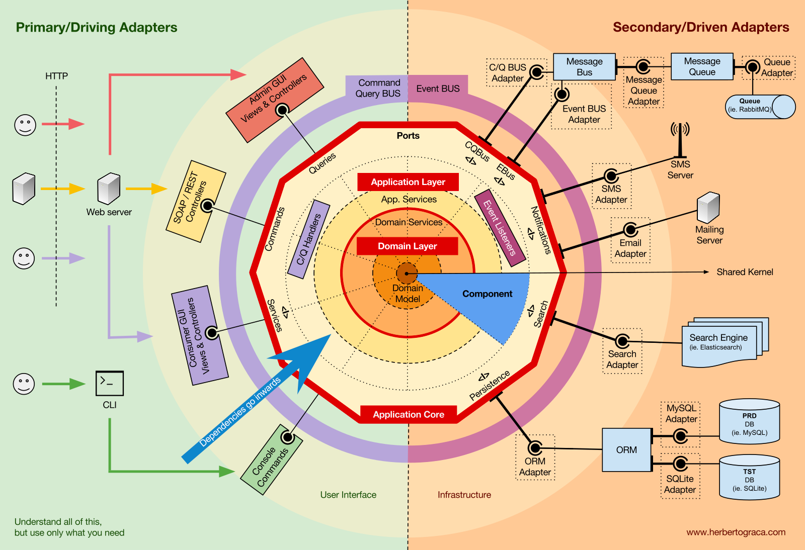

<h3> 정의 </h3>
DDD 또는 도메인 주도 설계라고 부른다. 도메인 패턴을 중심에 놓고 설계하는 방식을 일컫는다.  

<h3> 특징 </h3>

- <strong> 도메인 그 자체오 도메인 로직에 초점을 맞춘다. </strong> 일반적으로 많이 사용하는 데이터 중심의 접근법을 탈피해서 순수한 도메인의 모델과 로직에 집중하는 것을 말한다
- <strong> 보편적인(ubiquitous) 언어의 사용이다. </strong> 도메인 전문가와 소프트웨어 개발자 간의 커피뮤케이션 문제를 없애고 상호가 이해할 수 있고 모든 문서와 코드에 이르기까지 동일한 표현과 단어로 구성된 단일화된 언어체계를 구축해나가는 과정을 말한다. 이로서 분석 작업과 설계 그리고 구현에 이르기까지 통일된 방식으로 커뮤니케이션이 가능해진다.
- <strong> 소프트웨어 엔티티와 도메인 컨셉트를 가능한 가장 가까이 일치시키는 것이다. </strong> 모델과 설계가 다르고 그것과 코드가 다른 구조가 아니라 도메인 모델부터 코드까지 항상 함께 움직이는 구조의 모델을 지향하는 것이 DDD의 핵심원리이다.

<h3> 도메인 주도 설게 </h3>

데이터 주도 설계란 객체가 가져야할 데이터에 초점을 두고 설계를 하는 방식을 일컫는다.  
데이터 주도 설계에서는 <strong> 객체 자신이 포함하고 있는 데이터를 조작 </strong>하는데 필요한 행동을 정의한다.

<pre>
    public class Movie{
        private String title;
        private Date time;
    }
</pre>

설계 시 협력에 고민을 하지 않기 때문에 과도한 접근자와 수정자가 탄생하게 되는데 이는 후에 객체가 어떤 곳에 사용될지 알 수 없기 때문에 많은 접근자와 수정자를 만들게 된다.  
이는 결과적으로 캡슐화의 원칙을 위반하게 되는데 내부 구현이 퍼블릭 인터페이스에 노출되며 이때문에 강하게 결합되게 되기 때문이다.  
이로 인해 객체의 내부에 구현이 변경될 때 이 인터페이스에 의존하는 모든 객체들이 함께 변경되므로 높은 결합도를 유지하게 된다.

<h3> 도메인 주도 설계를 사용해야 하는 이유? </h3>

- 도메인 모델의 적용 범위를 구현까지 확장하여 도메인 지식을 구현 코드에 반영
- 공통의 언어(유비쿼터스)를 사용하여 도메인과 구현을 충분히 만족하는 모델을 만든다.
- 실제 코드로 구현 가능한 현실성 있는 도메인 모델 분석과 그것을 추사아화하는 설계

<h3> MSA에서 도메인 주도 설계를 많이 찾는 이유 </h3>

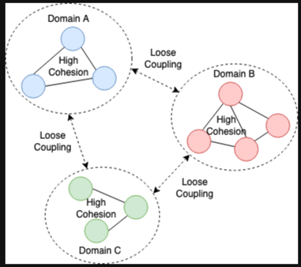

- 느슨한 결합도
- 높은 응집도

DDD를 기반으로 한 MSA를 적용하게 되면 도메인 내부 마이크로서비스와 외부 마이크로서비스로 구분이 되게 된다.  
도메인 내부 마이크로 서비스의 경우 API 기반의 Sync Call, 내부 메서드 호출, DB 통신등을 수행하게 된다.  
도메인 외부 마이크로 서비스는 Async Call(메세지 기반 통신) 등을 수행할 것이다.

<h3> DDD 용어 정리 </h3>

1. ubiquitous Language(유비쿼터스 랭귀지)
   도메인에서 사용하는 용어를 코드에 반영하지 않으면 그 코드는 개발자에게 코드의 의미를 해석해야 하는 부담을 준다. 
   코드의 가독성을 높여서 코드를 분석하고 이해하는 시간을 절약, 용어가 정의 될 대마다 용어 사전에 이를 기록하고 명확하게 정의 함으로써 추후 또는 다른 사람들도 공통된 언어를 사용할 수 있도록 한다.
2. 도메인 
   일반적인 요구사항, 소프트웨어로 해결하고자 하는 문제 영역
3. 도메인 모델 
   특정 도메인을 개념적으로 표현한 것, 도메인 모델을 사용하면 여러 관계자들이 동일한 모습으로 도메인을 이해하고 도메인 지식을 공유하는데 도움이 된다.
4. Entiy (엔티티)
   테이블 모델, 고유 식별자를 가짐
5. Value Object(벨류 오브젝트)
   데이터 표현 모델 식별자를 가지고 있지 않고 불변 타입이다.
   <pre>
    // 가변 객체
    class Cash{
        private int dollars;
        
        public void mul(int factor){
            this.dollars *= factor;
        }
    }
   
   
   // 불변 객체
   class Cash{
        private final int dollars;
    
        public Cash mul(int factor){
            return new Cash(this.dollars * factor);
        }
   }
   </pre>

6. Aggregate (에그리게이트)
   연관된 엔티티와 밸류 오브젝트의 묶음, 일관성과 트랙잭션, 분산의 단위
   루트 레그리게이트 : 에그리게이트가 제공해야 할 핵심 도메인 기능을 보유 하고 있는 모델 
   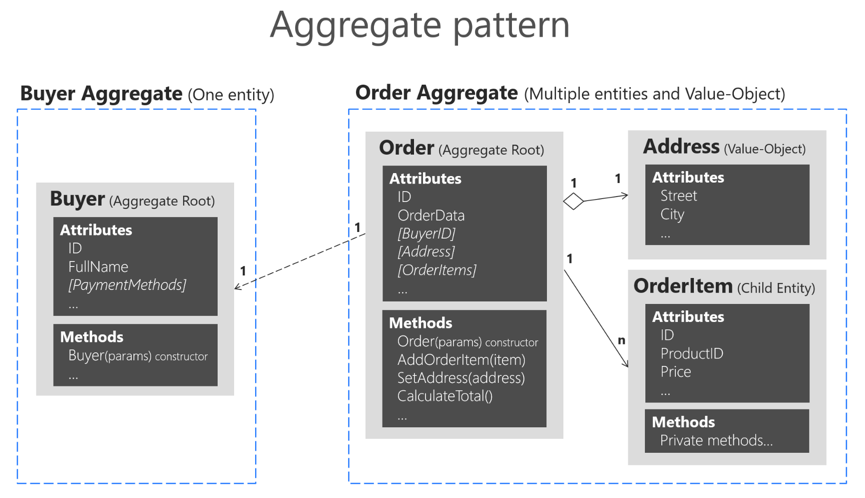

7. Bounded Context (바운디드 컨텍스트)
   특정한 도메인 모델이 적용되는 제한된 영역 경계 내에선 동일한 모델을 일관되게 적용
    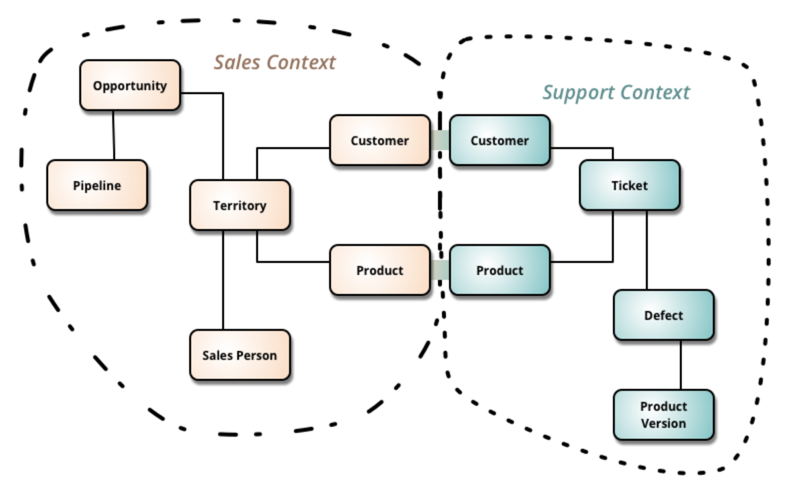

8. Context Map(컨텍스트 맵)   
   바운디드 컨텍스트 간의 관계
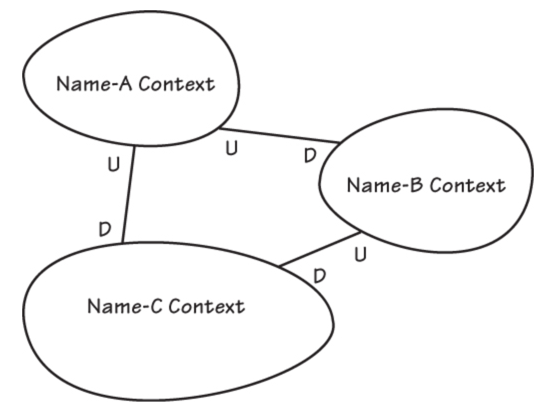

9. 이벤트 스토밍  
   도메인 전무가와 개발자가 참여 하여 어떻게 전략적으로 설계를 효율적으로 할것인가에 대한 방법이다.  
   이벤트 스토밍은 서비스에 필요한 모든 사람들이 다같이 모여서 진행을 한다.  
   개발요소가 아닌 이벤트와 비즈니스 프로세스에 집중한다.  
   팀 구성원 전체가 서비스 이해도를 증가할 수 있고, 도메인 전문가도 이해의 폭을 다시 넓히고 새로운 통찰력을 얻을 수 있다.  
     
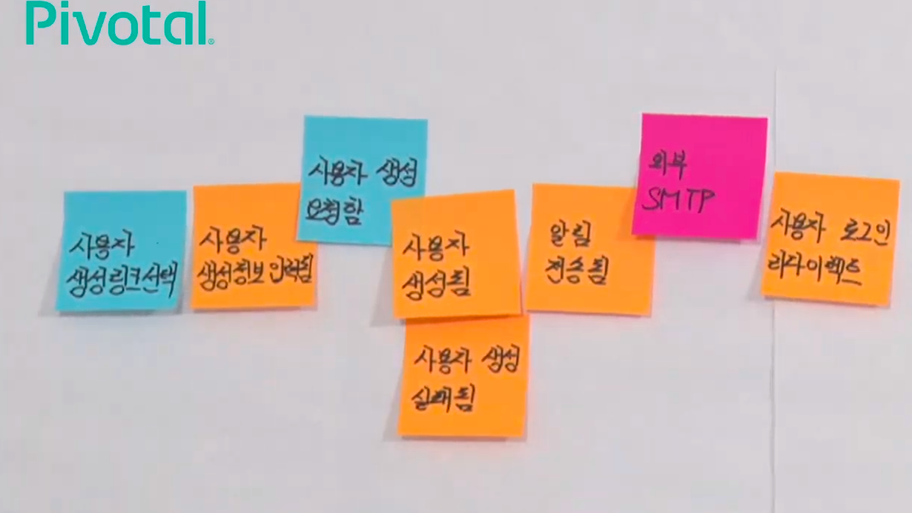
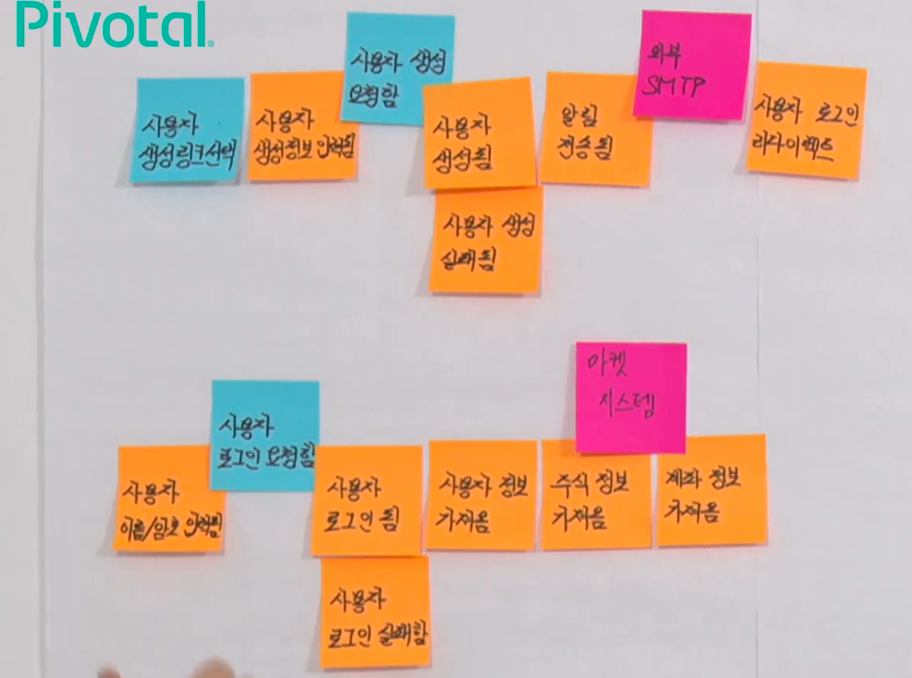
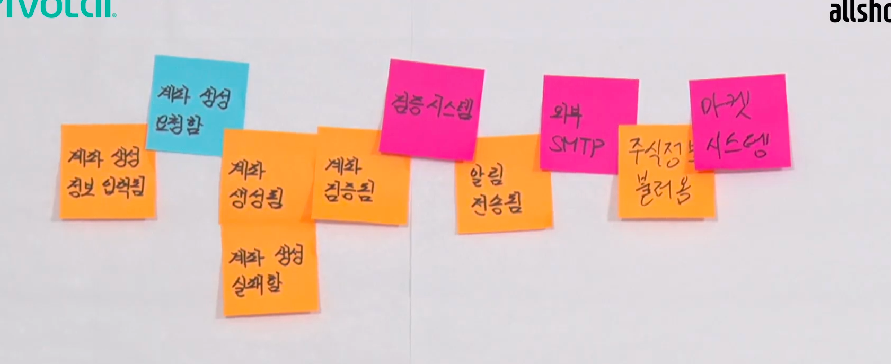

10. 보리스 다이어그램
    - Selected Aggregate
    - 데이터 그룹핑 연관도 파악
    - 동기/비동기/기타 유형 분리
    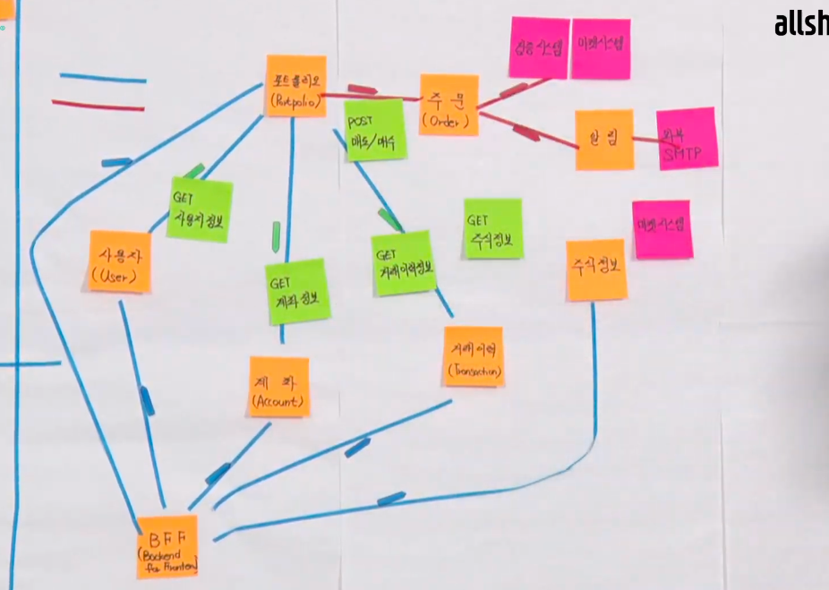
     
    
11. snap-E 
    - Selected User Story
    - UI
    - API
    - DATA
    - RISKS
    - STORIES
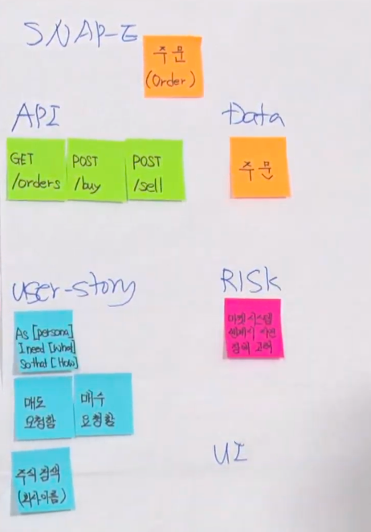
    
<h3> 도메인 주도 설계 아키텍처 </h3>

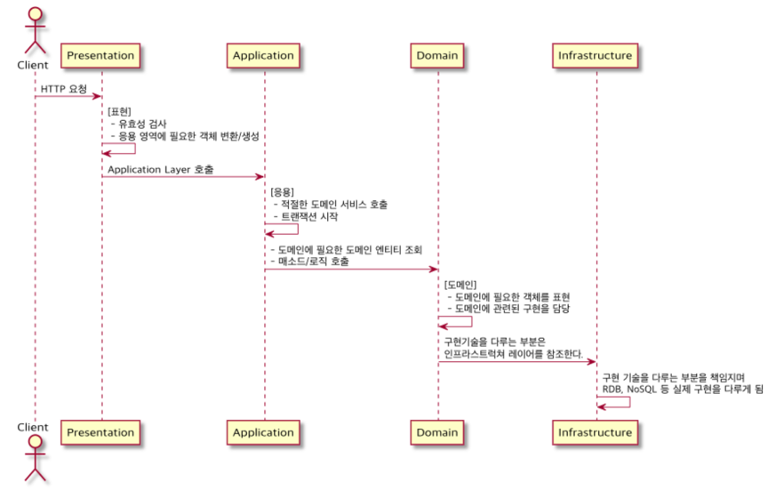

1. 프리젠테이션 레이어  
   UI 영역이라고 사용하는 곳도 있으며 에플리케이션에서 처리된 결과를 사용자에게 보여주는 역할을 한다.
2. 애플리케이션 레이어  
   사용자에게 제공해야 할 기능을 구현하다.
3. 도메인 레이어  
   도메인 모델을 구현한다. 한 애그리게이트에 넣기 애매한 도메인 개념을 구현하려면 애그리게이트에 억지로 넣기 보다는 도메인 서비스를 이용해서 도메인 개념을 명시적으로 드러내면 된다.  
    도메인 서비스를 사용하는 주체는 애그리게이트가 될 수 있고 응용 서비스가 될 수도 있다.
4. 인프라스트럭처 레이어  
   영속성을 구현하거나 외부와 통신하는 기능을 제공하는 레이어이다.
5. DIP (Depnedency Inversion Principle, 의존 역전 원칙)
     DIP는 의존성 역전 원칙으로 저수준의 모듈이고 고수준의 모듈에 의존하면 OCP 원칙을 적용할 수 있다.
     도메인 레이어의 서비스에서 사용하는 모듈은 인터페이스로 정의되어 인프라스트럭처 레이어에서 구현되고 있다.
      따라서 구현 기술이 변경되더라도 도메인 레이어에서는 동일한 비즈니스 로직을 제공할 수 있고 애플리케이션 성격에 따라 다양한 구현 기술을 적용할 수 있다.

<h3> Event Driven Design </h3>

<h4> 이벤트 관련 구성요소 </h4>

- 도메인 모델에서 이벤트 주체는 엔티티, 벨류, 도메인 서비스와 같은 도메인 객체이다.
- 도메인 객체는 도메인 로직을 실행해서 상태가 바뀌면 관련 이벤트를 발생한다.
- 이벤트 핸들러(Handler)는 이벤트 생성 주체가 발생한 이벤트에 반응한다.
- 이벤트 핸들러는 생성 주체가 발생한 이벤트를 전달받아 이벤트에 담긴 데이터를 이용해서 원하는 기능을 실행한다.
- 이벤트 생성 주체와 이벤트 핸들러를 연결해 주는 것이 이벤트 디스패치(dispatcher)이다.
- 이벤트를 전달받은 디스패처는 해당 이벤트를 처리할 수 있는 핸들러에 이벤트를 전파한다.

<h4> 이벤트의 구성 </h4>

- 이벤트는 현재 기준으로 (바로 직전이라도) 과거에 벌어진 것을 표현하기 때문에 이벤트 이름에는 과거 시제를 사용한다.
- 이벤트는 이벤트 핸들러가 작업을 수행하는 데 필요한 최소한의 데이터를 담아야 한다.

<h4> 이벤트 용도 </h4>

- 도메인의 상태가 바뀔 때 다른 후처리를 해야 할 경우 후처리를 실행하기 위한 트리거로 이벤트를 사용할 수 있다.
- 이벤트의 두 번째 용도는 서로 다른 시스템 간의 데이터 동기화이다.

<h4> 이벤트 장점 </h4>

- 서로 다른 도메인 로직이 섞이는 것을 방지할 수 있다.
- 이벤트 핸들러를 사용하면 기능 확장도 용이하다.

<h4> 비동기 이벤트 처리 </h4>

- 로컬 핸들러를 비동기로 실행하기 
- 메시지 큐를 사용하기
- 이벤트 저장소와 이벤트 포워더 사용하기
- 이벤트 저장소와 이벤트 제공 API 사용하기

<h4> CQRS(명령 및 쿼리 책임 분리) </h4>

<h5> 단일 모델의 단점 </h5>

- 객체 지향으로 도메인 모델을 구현할 때 주로 사용하는 ORM 기법은 도메인의 상태 변경을 구현하는데 적합하지만, 여러 애그리거트에서 데이터를 가져와 출력하는 기능을 구현하기에는 고려할 것들이 많아서 구현을 복잡하게 만드는 원이이 된다.
- 이런 구현 복잡도를 낮추는 방법은 상태 변경을 위해 모델과 조회를 위한 모델을 분리하는 것이다.

<h5>  CQRS소개 </h5>

- 상태를 변경하는 명령(Command)을 위한 모델과 상태를 제공하는 조회(Query)를 위한 모델을 분리하는 패턴이다.
- CQRS는 복잡한 도메인에 적합하다.

<h5> 웹과 CQRS </h5>

- 메모리에 캐시하는 데이터는 DB에 보관된 데이터를 그대로 저장하기 보다는 화면에 맞는 모양으로 변환한 데이터를 캐시할 때 성능에 유리하다.
- 조회 속도를 높이기 위해 별도 처리를 하고 있다면 명시적으로 명령 모델과 조회 모델을 구분하자.
- 조회 기능 때문에 명령 모델이 복잡해지는 것을 방지할 수 있고 명령 모델에 관계없이 조회 기능에 특화된 구현 기법을 보다 쉽게 적용할 수 있다.

<h5> CQRS 장단점 </h5>

- 명령 모델을 구현할 때 도메인 자체에 집중할 수 있다.
- 조회 성능을 향상시키는 데 유리하다.
- 구현해야 할 코드가 더 많다.
- 더 많은 구현 기술이 필요하다.
   
    이벤트 소싱과 항상 함께 알아두어야 할 개념으로 CQRS가 있으며 커맨드와 쿼리 책임을 분리하자는 것으로 커맨드는 일반적인 디비 기준으로 상태를 변경하 C,U,D와 같은 메소드로 생각할 수 잇으며 쿼리는 단순 데이터를 조회하기 위한 리드 메소드로 생각할 수 있다.   
    이렇게 기능을 분리하면 이벤트 소싱 패턴을 좀 더 손쉽게 적용할 수 있다.  
    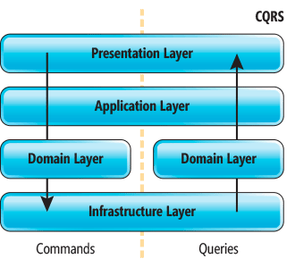

이러한 기술을 모든곳에 적용하는 것은 쉽지 않으며 이벤트 소싱을 위해서 이벤트 스토어라는 중간 레이어가 필요하며 또한 CQRS로 분리하기 위해서 쓰기/읽기 레이어로 분리해야 한다.  
이러한 레이어 분리는 전체 시스템에 관리 포인트를 늘이고 시스템의 구조를 복잡하게 만드는 결과를 가져오게 된다.  
이러한 이유로 MSA에 적용하는 것은 많은 이점을 주게 된다.  
그러나 작은 시스템이나 모놀리틱 방식에 적용하는 것에 무리가 있다.
